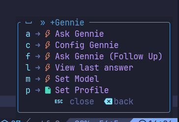

# Gennie.nvim

Neovim plugin for [Gennie Cli](https://github.com/robertoseba/gennie)

This is a simple Neovim plugin I created for personal use. It is my first attempt at developing a Neovim plugin using Lua, so please manage your expectations. I use it daily in my work, and it has been particularly helpful with managing custom profiles.

[Context: "IMPORTANT: This plugin has only be tested at Lazyvim distribution"]

## Screenshots


### Model and Profile selection


### Which-key config



## Installation

1. Create a `gennie.lua` inside your Lazyvim `plugins` folder
2. Add the following contents (configure it as you wish)

```lua

return {
  "robertoseba/gennie.nvim"
  opts = {
    default_model = "gpt-4o",
    default_profile = "default",
    available_profiles = { "aws", "go", "linux", "personal", "php", "sql", "default" },
  },
  dependencies = {
    "folke/which-key.nvim",
    optional = true,
    opts = {
      spec = {
        { "<leader>a", group = "Gennie", mode = { "n", "v" } },
      },
      icons = {
        rules = {
          { pattern = "gennie", icon = LazyVim.config.icons.kinds.Event, color = "orange" },
        },
      },
    },
  },
  keys = {
    {
      "<leader>aa",
      function()
        return require("gennie").ask_gennie()
      end,
      desc = "Ask Gennie",
      mode = "n",
    },
    {
      "<leader>af",
      function()
        return require("gennie").ask_gennie({ is_followup = true })
      end,
      desc = "Ask Gennie (Follow Up)",
      mode = "n",
    },
    {
      "<leader>aa",
      function()
        return require("gennie").ask_gennie_visual()
      end,
      desc = "Ask Gennie With Selected",
      mode = "v",
    },
    {
      "<leader>af",
      function()
        return require("gennie").ask_gennie_visual({ is_followup = true })
      end,
      desc = "Ask Gennie With Selected (Follow up)",
      mode = "v",
    },
    {
      "<leader>am",
      function()
        return require("gennie").set_model()
      end,
      desc = "Set Model",
      mode = { "n", "v" },
    },
    {
      "<leader>ap",
      function()
        return require("gennie").set_profile()
      end,
      desc = "Set Profile",
      mode = { "n", "v" },
    },
    {
      "<leader>al",
      function()
        return require("gennie").last_answer()
      end,
      desc = "View last answer",
      mode = { "n", "v" },
    },
  },
}

